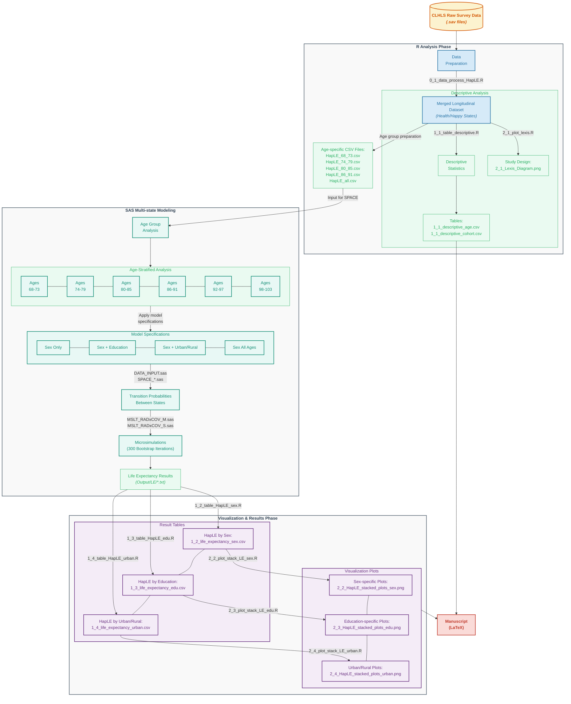

# HapLE_Cohort Project: Cohort Trends of Happy Life Expectancy among Older Adults in China

This repository contains the code and data structure for analyzing cohort trends of happy life expectancy (HapLE) among older adults in China, using data from the Chinese Longitudinal Healthy Longevity Survey (CLHLS).

## Project Structure

The project is organized into three main components: R for data processing and visualization and SAS for multistate modeling.

### R Components (`R_HapLE/`)

The R directory contains the following primary elements:

#### CLHLS Data

- **clhls data/**: Contains original survey datasets from CLHLS (2002-2018), used as input for the analysis.
  - `clhls_2002_2018_longitudinal_dataset_released_version1.sav`: Main longitudinal dataset (2002-2018)
  - `clhls_2011_2018_longitudinal_dataset_released_version1.sav`: Extended longitudinal dataset (2011-2018)
  - `code book/`: Documentation for CLHLS datasets
  - `questionare/`: Questionnaires for survivors and deceased respondents used in CLHLS 2017-2018

#### R Code

- **R code/**: Contains the R scripts that process the data and generate descriptive statistics and visualizations:
  - `0_1_data_process_HapLE.R`: Main data processing script for HapLE analysis
  - `0_1_data_process_HapLE_4s.R`: Data processing for 4-state model
  - `1_1_table_descriptive.R`: Generates descriptive statistics tables for the cohort
  - `1_1_table_descriptive_4s.R`: Descriptive statistics for 4-state model
  - `1_2_table_HapLE_sex.R` and `1_2_table_HapLE_sex_4s.R`: Creates HapLE tables by sex
  - `1_3_table_HapLE_edu.R` and `1_3_table_HapLE_edu_4s.R`: Creates HapLE tables by education
  - `1_4_table_HapLE_urban.R` and `1_3_table_HapLE_urban_4s.R`: Creates HapLE tables by urban/rural residence
  - `2_1_plot_lexis.R`: Creates Lexis diagram visualization showing the study design
  - `2_2_plot_stack_LE_sex.R`: Generates stacked plots for life expectancy by sex
  - `2_3_plot_stack_LE_edu.R`: Generates stacked plots for life expectancy by education
  - `2_4_plot_stack_LE_urban.R`: Generates stacked plots for life expectancy by urban/rural

#### R Output

- **R output/**: Contains the output files from R analysis:
  - Descriptive statistics tables (`1_1_descriptive_age.csv`, `1_1_descriptive_cohort.csv`, `1_1_descriptive_age_4s.csv`, `1_1_descriptive_cohort_4s.csv`)
  - Life expectancy tables (`1_2_life_expectancy_sex.csv`, `1_3_life_expectancy_edu.csv`, `1_4_life_expectancy_urban.csv`)
  - HTML and LaTeX formatted tables (`*.html`, `*.tex`)
  - Visualization files (`2_1_Lexis_Diagram.png`, `2_2_HapLE_stacked_plots_sex.png`, `2_3_HapLE_stacked_plots_edu.png`, `2_4_HapLE_stacked_plots_urban.png`)
- **space input/**: Contains processed CSV files ready for SAS multistate modeling, separated by age groups:
  - `HapLE_68_73.csv`, `HapLE_74_79.csv`, `HapLE_80_85.csv`, `HapLE_86_91.csv`
  - `HapLE_all.csv`: Combined data for all age groups
  - `HapLE_*_4s.csv`: 4-state model versions for each age group

### SAS Components (`SAS_HapLE/`)

The SAS directory is organized by age groups and analysis types:

#### Age Group Directories

Each age group directory (68_73, 74_79, 80_85, 86_91~~, 92_97, 98_103~~) contains:

- **sex/**: Analysis by sex only
  - `age+age2+sex+cohort+inter3/`: Model specification with interaction terms
- **sex_all/**: Analysis by sex for all ages combined
  - `age+age2+sex+cohort+inter3/`: Model specification with interaction terms
- **sex+edu/**: Analysis by sex and education
  - `age+age2+sex+cohort+inter3/`: Model specification including education
- **sex+urban/**: Analysis by sex and urban/rural residence
  - `age+age2+sex+cohort+inter3/`: Model specification including urban/rural

Each model specification directory contains:

- `DATA_INPUT.sas`: Prepares data for state-space modeling
- `MSLT_RADxCOV_M.sas` and `MSLT_RADxCOV_S.sas`: Multi-state life table modeling scripts
- `SPACE_*` files: Core state-space model implementation
- `BSMSlog*.LOG`: SAS log files from model runs (10 bootstrap iterations)
- Output files (`*.txt`, `*.sas7bdat`)

#### Support Files

- **Output/**: Contains model results organized by analysis type:
  - `LE/`: Life expectancy results by different groupings (sex, sex_all, sex+edu, sex+urban)
    - Files follow naming pattern: `LE_{age_group}_{grouping}.txt` and `LE_{age_group}_{grouping}_b300.txt` for bootstrap results
  - `Model/`: Model statistics and parameters by grouping
    - Files follow naming pattern: `Model_{age_group}_{grouping}.txt`
- **SAS code revised/**: Contains revised SAS code templates for this project
  - `simyear_re/`: Standard simulation year templates
  - `simyear+combine_state_re/`: Combined state simulation templates
- **SPACE manual/**: Contains documentation for the SPACE (Stochastic Population Analysis for Complex Events) program
  - `SPACE_manual.pdf`: Complete user manual
  - `Cai et al 2010 (SPACE paper).pdf`: Original methodology paper

## Workflow

The analysis follows this sequential workflow (See details in `Manuscript/`):

1. **Data Preparation (R)** `0_1_data_process_HapLE.R`

   - Import original CLHLS datasets (2002-2018 and 2011-2018)
   - Define happy states for each respondent
   - Create cohorts from different survey waves
   - Process data for both 3-state and 4-state models
   - Export processed data by age groups (68-73, 74-79, 80-85, 86-91~~, 92-97, 98-103~~)
2. **Descriptive Analysis (R)** `1_1_table_descriptive.R`

   - Generate cohort characteristics tables
   - Analyze sample distributions by age, sex, education, and urban/rural residence
   - Create both standard and 4-state model descriptive tables
   - Create Lexis plot showing sample structure `2_1_plot_lexis.R`
3. **Multistate Modeling (SAS)** `SAS_HapLE/`

   - Import processed data for each age group `DATA_INPUT.sas`
   - Specify SPACE parameters for multi-state analysis using various model specifications
   - Run models with different covariate combinations:
     - Sex only (`sex/`)
     - Sex for all ages combined (`sex_all/`)
     - Sex + Education (`sex+edu/`)
     - Sex + Urban/Rural residence (`sex+urban/`)
   - Apply model specification: `age+age2+sex+cohort+inter3` with interaction terms
   - Perform microsimulation using `MSLT_RADxCOV_M.sas` and `MSLT_RADxCOV_S.sas`
   - Create 300 bootstrapped simulations (10 iterations × 30 sets) to estimate confidence intervals
   - Export life expectancy estimates to `Output/LE/` directory
   - **More details about `SPACE` program**:
     - References: `SPACE manual/`
     - Websites: [https://sites.utexas.edu/space/](https://sites.utexas.edu/space/)
4. **Results Visualization (R)**

   - Import life expectancy estimates from SAS `Output/LE/`
   - Create tables showing HapLE by different demographic groups:
     - `1_2_table_HapLE_sex.R`: Life expectancy by sex
     - `1_3_table_HapLE_edu.R`: Life expectancy by education
     - `1_4_table_HapLE_urban.R`: Life expectancy by urban/rural residence
   - Generate stacked bar charts showing the proportion of remaining life spent in each state:
     - `2_2_plot_stack_LE_sex.R`
     - `2_3_plot_stack_LE_edu.R`
     - `2_4_plot_stack_LE_urban.R`

## Methodology References

1. Liu, Z., Han, L., Feng, Q., Dupre, M. E., Gu, D., Allore, H. G., Gill, T. M., & Payne, C. F. (2019). Are china’s oldest-old living longer with less disability? A longitudinal modeling analysis of birth cohorts born 10 years apart. *BMC Medicine*, 17(1), 23. [https://doi.org/10.1186/s12916-019-1259-z](https://doi.org/10.1186/s12916-019-1259-z)
2. Payne, C. F. (2022). Expansion, compression, neither, both? Divergent patterns in healthy, disability-free, and morbidity-free life expectancy across U.S. birth cohorts, 1998-2016. *Demography*, 59(3), 949–973. [https://doi.org/10.1215/00703370-9938662](https://doi.org/10.1215/00703370-9938662)
3. Payne, C. F., & Wong, R. (2019). Expansion of disability across successive mexican birth cohorts: A longitudinal modelling analysis of birth cohorts born 10 years apart. *J Epidemiol Community Health*, 73(10), 900–905. [https://doi.org/10.1136/jech-2019-212245](https://doi.org/10.1136/jech-2019-212245)
4. Shen, T., & Payne, C. F. (2023). Disability and morbidity among US birth cohorts, 1998–2018: A multidimensional test of dynamic equilibrium theory. *SSM - Population Health*, 24, 101528. [https://doi.org/10.1016/j.ssmph.2023.101528](https://doi.org/10.1016/j.ssmph.2023.101528)
