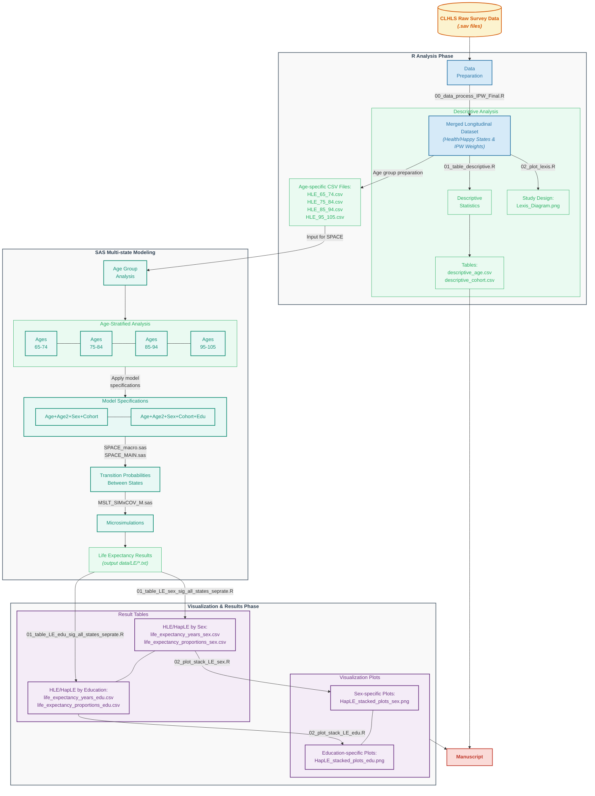

# HapLE_Cohort Project: Cohort Trends of Healthy and Happy Life Expectancy among Older Adults in China

This repository contains the code and data structure for analyzing cohort trends of healthy life expectancy (HLE) and happy life expectancy (HapLE) among older adults in China, using data from the Chinese Longitudinal Healthy Longevity Survey (CLHLS).

## Project Structure

The project is organized into three main components: R for data processing and visualization, SAS for multistate modeling and manuscripts for the final paper.

### R Components

The R directory contains the following primary elements:

#### CLHLS Data

- **clhls data/**: Contains original survey datasets (`*.sav`) from CLHLS (1998-2018), used as input for the analysis.
  - `code book/`: Code book for CLHLS dataset
  - `questionare/`: survivors and deceased questionnaires used in CLHLS 2017-2018

#### R Code

- **R code/**: Contains the R scripts that process the data and generate descriptive statistics and visualizations:
  - `00_data_process_IPW_Final.R`: Processes the CLHLS data, creates health state variables, and applies Inverse Probability Weighting (IPW) to account for attrition.
  - `01_table_descriptive.R`: Generates descriptive statistics tables for the cohort.
  - `01_table_LE_edu_sig_all_states_seprate.R` and `01_table_LE_sex_sig_all_states_seprate.R`: Create tables showing life expectancy statistics by education level and sex.
  - `02_plot_lexis.R`: Creates a Lexis diagram visualization showing the study design.
  - `02_plot_stack_LE_edu.R` and `02_plot_stack_LE_sex.R`: Generate stacked plots visualizing life expectancy by education and sex.

#### R Output

- **R output/**: Contains the output files from R analysis:
  - Descriptive statistics tables (`descriptive_age.csv`, `descriptive_cohort.csv`)
  - Life expectancy tables (`life_expectancy_years_*.csv`, `life_expectancy_proportions_*.csv`)
  - Visualization files (`HapLE_stacked_plots_*.png`, `Lexis_Diagram.png`)
- **space input/**: Contains processed CSV files ready for SAS multistate modeling, separated by age groups:
  - `HLE_65_74.csv`
  - `HLE_75_84.csv`
  - `HLE_85_94.csv`
  - `HLE_95_105.csv`

### SAS Components

The SAS directory is organized by age groups and analysis types:

#### Age Group Directories

Each age group (65-74, 75-84, 85-94, 95-105) contains:

- **sex/**: Analysis by sex only

  - Various model specifications (e.g., `age+age2+sex+cohort`, `age+sex+cohort+inter`)
- **sex+edu/**: Analysis by both sex and education

  - Various model specifications with different interaction terms

Each model specification directory contains:

- `DATA_INPUT.sas`: Prepares data for state-space modeling
- `MSLT_*` files: Multi-state life table modeling scripts
- `SPACE_*` files: Core state-space model implementation
- Output files (`*.LOG`, `*.txt`, `*.sas7bdat`)

#### Support Files

- **input data/**: Contains the processed CSV files for SAS analysis
- **output data/**: Contains model results:
  - `LE/`: Life expectancy results by different groupings
  - `test_les/`: test results of life expectancy from different model specifications
  - `test_models/`: model statistics of different model specifications
    - `Base Models.md`: summary of model statistics from base model
    - `Base Models + Edu.md`: summary of model statistics from base model with education varibale added
- **SAS code revised/**: Contains revised SAS code templates for this project
- **SPACE manual/**: Contains documentation for the SPACE (Stochastic Population Analysis for Complex Events) program

### Manuscript Components

The Manuscript directory contains manuscripts for the final paper.

## Workflow

The analysis follows this sequential workflow (See details in `Manuscript\`):

1. **Data Preparation (R)** `00_data_process_IPW_Final.R`

   - Import original CLHLS datasets
   - Define health states (happy, healthy) for each respondent
   - Create cohorts from different survey waves (2002-2008, 2011-2018)
   - Calculate Inverse Probability Weights to account for attrition
     - IPW Diagnostics: use the `bal.tab` function from the `cobalt` package to check the balance of baseline covariates between the "lost" and "not lost" groups.
   - Export processed data by age groups
2. **Descriptive Analysis (R)** `01_table_descriptive.R`

   - Generate cohort characteristics tables
   - Analyze sample distributions by age, sex, education, and other variables
   - Create Lexis plot showing sample structure `02_plot_lexis.R`
3. **Multistate Modeling (SAS)** `SAS/`

   - Import processed data for each age group `DATA_INPUT.sas`
   - Specify SPACE parameters for multi-state analysis `SPACE_Macro.sas`
   - Run different model specifications with various covariates `test_models/`
     - Test the base model `age+sex+cohort` , the model including the squared age term `age+age2+sex+cohort`, and the model including interaction terms `age+age2+sex+cohort+inter*`.
     - The results showed that the interaction terms were not significant in the 85-94 and 95-105 age groups. To ensure the stability and parsimony of the model, the compromise model - the model including the squared age term `age+age2+sex+cohort` and `age+age2+sex+cohort+edu` - was selected as base model to modeling the transition probabilities.
   - Perform microsimulation to simulate transitions between states over 10 or 11 years
   - Create 200 bootstrapped simulations to estimate confidence intervals
   - Export life expectancy estimates
   - **More details about `SPACE` program**:
     - References: `SPACE manual/`
     - Websites: [https://sites.utexas.edu/space/](https://sites.utexas.edu/space/)
4. **Results Visualization (R)**

   - Import life expectancy estimates from SAS `LE/`
   - Create tables showing years lived in different states `01_table_LE_*_sig_all_states_seprate.R`
   - Generate stacked bar charts showing the proportion of remaining life spent in each state `02_plot_stack_LE_*.R`

## Methodology References

1. Liu, Z., Han, L., Feng, Q., Dupre, M. E., Gu, D., Allore, H. G., Gill, T. M., & Payne, C. F. (2019). Are china’s oldest-old living longer with less disability? A longitudinal modeling analysis of birth cohorts born 10 years apart. *BMC Medicine*, 17(1), 23. [https://doi.org/10.1186/s12916-019-1259-z](https://doi.org/10.1186/s12916-019-1259-z)
2. Payne, C. F. (2022). Expansion, compression, neither, both? Divergent patterns in healthy, disability-free, and morbidity-free life expectancy across U.S. birth cohorts, 1998-2016. *Demography*, 59(3), 949–973. [https://doi.org/10.1215/00703370-9938662](https://doi.org/10.1215/00703370-9938662)
3. Payne, C. F., & Wong, R. (2019). Expansion of disability across successive mexican birth cohorts: A longitudinal modelling analysis of birth cohorts born 10 years apart. *J Epidemiol Community Health*, 73(10), 900–905. [https://doi.org/10.1136/jech-2019-212245](https://doi.org/10.1136/jech-2019-212245)
4. Shen, T., & Payne, C. F. (2023). Disability and morbidity among US birth cohorts, 1998–2018: A multidimensional test of dynamic equilibrium theory. *SSM - Population Health*, 24, 101528. [https://doi.org/10.1016/j.ssmph.2023.101528](https://doi.org/10.1016/j.ssmph.2023.101528)
